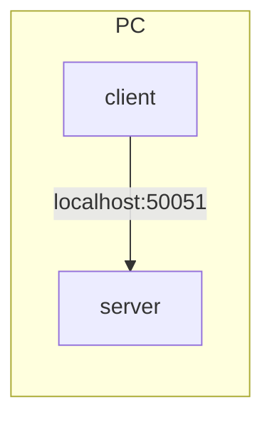
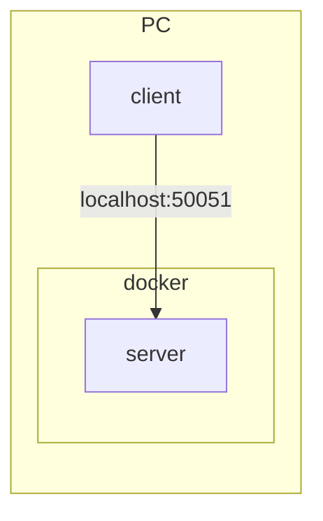
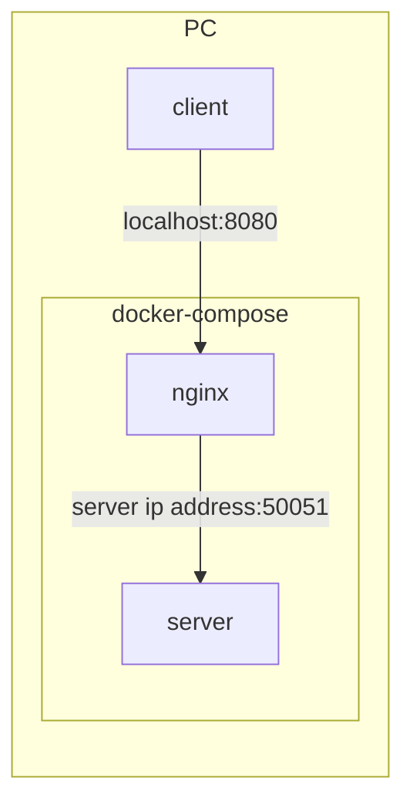

# poc-grpc-with-proxy

grpc に proxy を利用した構成の実現方法調査

### Step 1



#### server

1. change host address to `localhost:50051` in `greeter_server.py`

2. launch

```console
cd example/server
python greeter_server.py
```

#### client

1. change host address to `localhost:50051` in `greeter_client.py`

2. launch

```console
cd example/client
python greeter_client.py
```

### Step 2



#### server

1. change host address to `localhost:50051` in `greeter_server.py`

2. launch

```console
cd example
docker compose up
```

#### client

1. change host address to `localhost:50051` in `greeter_client.py`

2. launch

```console
cd example/client
python greeter_client.py
```

### Step 3



1. change host address to `localhost:50051` in `greeter_server.py`

2. launch

```console
cd example
docker compose up
```

#### client

1. change host address to `localhost:8080` in `greeter_client.py`

2. launch

```console
cd example/client
python greeter_client.py
```

## WIP

### 8080/tcp を nginx が listen しているか確認する方法

```console
$ ss -tanl | grep 8080
LISTEN 0 128 *:8080 *:*

$ ss -tanlp | grep 8080
LISTEN 0 128 *:8080 *:* users:*1
```

### パケットキャプチャ

```console
$ tcpdump -i any tcp port 8080 or tcp port 50051 -w /tmp/grpc.pcap
```
