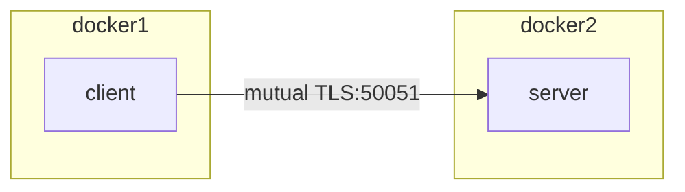

# poc-grpc-with-proxy

grpc に mutual TLS を利用した構成の実現方法調査

## 構成



## Prepare

### 自己証明書作成

```console
./make_cert.sh
```

証明書中身を確認する

```console
openssl x509 -in ssl/client.crt -text -noout
```

## Usage

```console
docker compose up
```

## その他

### パケットキャプチャの方法

#### 準備

1. キャプチャしたい PC 上でパケットキャプチャ(tcpdump)をインストール

```console
sudo apt-get install tcpdump
sudo su -
cd /dev/
cp -a /usr/sbin/tcpdump .
```

2. キャプチャしたデータを解析したい PC に wireshark をインストール

#### 使い方

1. キャプチャしたい PC 上で以下のコマンドを実施し、tcpdump を起動

```console
./tcpdump -i any tcp port 8080 or tcp port 50051 -w grpc.cap
```

2. 通信を実施
3. tcpdump を停止する
4. 生成された`grpc.cap`をキャプチャしたデータを解析したい PC にダウンロード
5. wireshark で`grpc.cap`を開く

## WIP 情報

### 8080/tcp を nginx が listen しているか確認する方法

```console
$ ss -tanl | grep 8080
LISTEN 0 128 *:8080 *:*

$ ss -tanlp | grep 8080
LISTEN 0 128 *:8080 *:* users:*1
```
