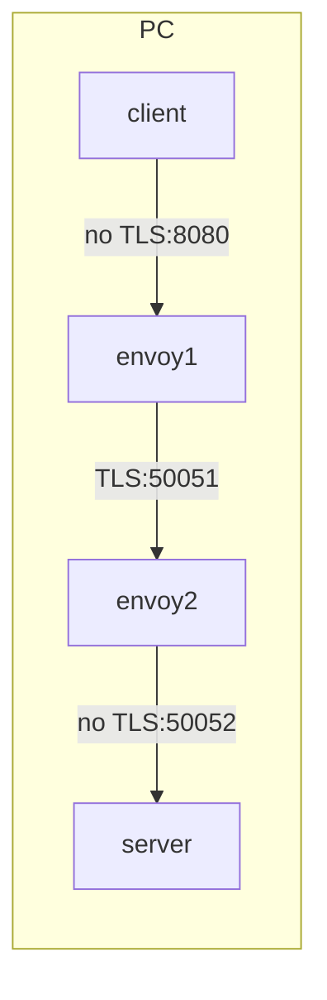

# poc-grpc-with-proxy

grpc に TLS proxy を利用した構成の実現方法調査

### 構成



### Prepare

#### get envoy binary

```console
docker cp `docker create envoyproxy/envoy-dev:latest`:/usr/local/bin/envoy .
```

#### 自己証明書作成

```console
$ cd ssl
# 秘密鍵と公開鍵を作成
$ openssl req -x509 -nodes -newkey rsa:2048 -days 365 -keyout privatekey.pem -out cert.pem -subj "/CN=127.0.0.1"
# 公開鍵でroot証明書を作る
$ openssl x509 -in cert.pem -out root.crt
```

#### Usage

1. Start gRPC Server

```console
python server/greeter_server.py
```

2. Start Envoy Server Proxy

```console
./envoy -c proxy/envoy_server.yaml --base-id 0 -l debug
```

3. Start Envoy Client Proxy

```console
./envoy  -c proxy/envoy_client.yaml --base-id 1 -l debug
```

4. Start gRPC Client

```console
python client/greeter_client.py
```

## WIP

### 8080/tcp を nginx が listen しているか確認する方法

```console
$ ss -tanl | grep 8080
LISTEN 0 128 *:8080 *:*

$ ss -tanlp | grep 8080
LISTEN 0 128 *:8080 *:* users:*1
```

### パケットキャプチャ

```console
$ tcpdump -i any tcp port 8080 or tcp port 50051 -w /tmp/grpc.pcap
```
