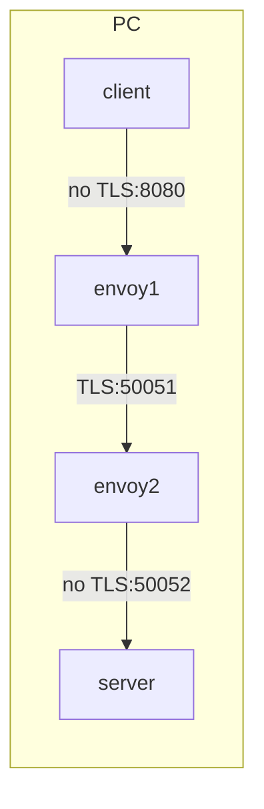

# poc-grpc-with-proxy

grpc に TLS proxy を利用した構成の実現方法調査

## 構成



## Prepare

### get envoy binary

```console
docker cp `docker create envoyproxy/envoy-dev:latest`:/usr/local/bin/envoy .
```

### 自己証明書作成

```console
cd ssl

# 秘密鍵と公開鍵を作成
openssl req -x509 -nodes -newkey rsa:2048 -days 365 -keyout privatekey.pem -out cert.pem -subj "/CN=127.0.0.1"

# 公開鍵でroot証明書を作る
openssl x509 -in cert.pem -out root.crt
```

## Usage
### for Python

1. Start gRPC Server

```console
python server/greeter_server.py
```

2. Start Envoy Server Proxy

```console
./envoy -c proxy/envoy_server.yaml --base-id 0 -l debug
```

3. Start Envoy Client Proxy

```console
./envoy  -c proxy/envoy_client.yaml --base-id 1 -l debug
```

4. Start gRPC Client

```console
python client/greeter_client.py
```

### for c++

1. compile
```console
cd cpp/helloworld/cmake/build
cmake -DCMAKE_PREFIX_PATH=$MY_INSTALL_DIR ../..
make -j 4
```

2. Start gRPC Server

```console
./cpp/helloworld/cmake/build/greeter_server
```

2. Start Envoy Server Proxy

```console
./envoy -c proxy/envoy_server.yaml --base-id 0 -l debug
```

3. Start Envoy Client Proxy

```console
./envoy  -c proxy/envoy_client.yaml --base-id 1 -l debug
```

4. Start gRPC Client

```console
./cpp/helloworld/cmake/build/greeter_client
```

## その他

### パケットキャプチャの方法

#### 準備

1. キャプチャしたいPC上でパケットキャプチャ(tcpdump)をインストール
```console
sudo apt-get install tcpdump
sudo su -
cd /dev/
cp -a /usr/sbin/tcpdump .
```
2. キャプチャしたデータを解析したいPCにwiresharkをインストール

#### 使い方

1. キャプチャしたいPC上で以下のコマンドを実施し、tcpdumpを起動
```console
./tcpdump -i any tcp port 8080 or tcp port 50051 -w grpc.cap
```
2. 通信を実施
3. tcpdumpを停止する
4. 生成された`grpc.cap`をキャプチャしたデータを解析したいPCにダウンロード
5. wiresharkで`grpc.cap`を開く


## WIP情報

### 8080/tcp を nginx が listen しているか確認する方法

```console
$ ss -tanl | grep 8080
LISTEN 0 128 *:8080 *:*

$ ss -tanlp | grep 8080
LISTEN 0 128 *:8080 *:* users:*1
```
